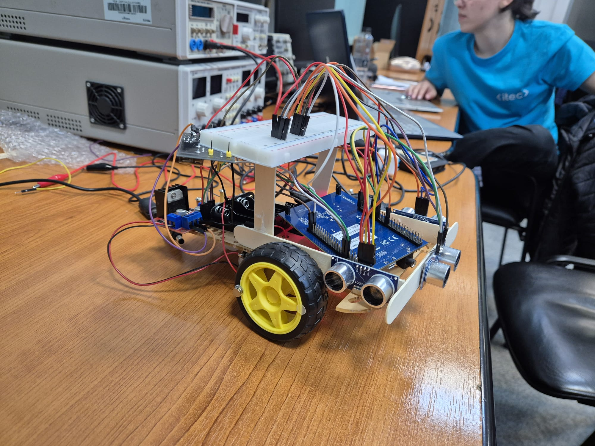

This project was developed during the ITEC Embedded Development challenge – a 40-hour competition organized by the Faculty of Automation and Computers at UPT. The task was to design and implement a functional embedded hardware solution using the STM32F407G-DISC1 development board and common lab resources.

Our solution is an autonomous robot capable of solving a maze using the right-hand rule algorithm. The robot was built from scratch, combining both hardware and software components.

